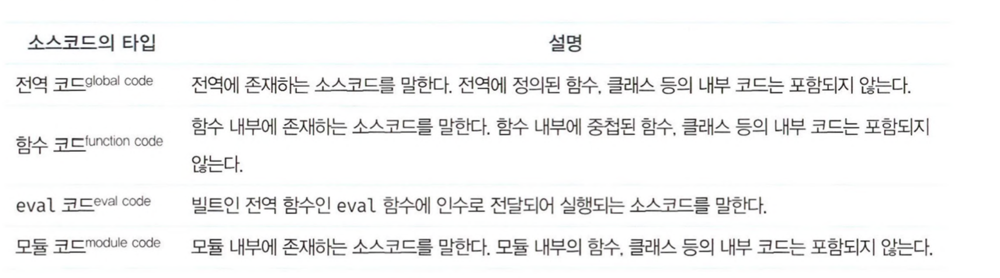
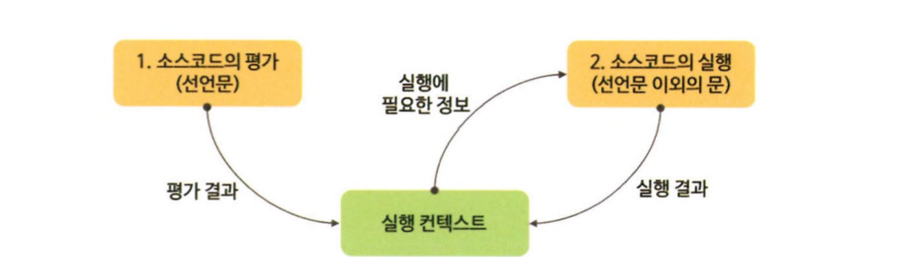
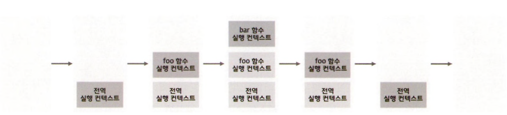
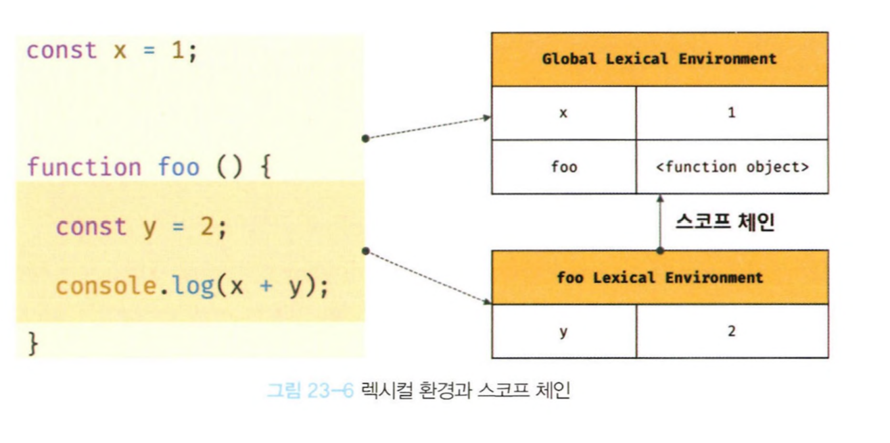
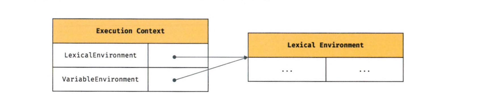
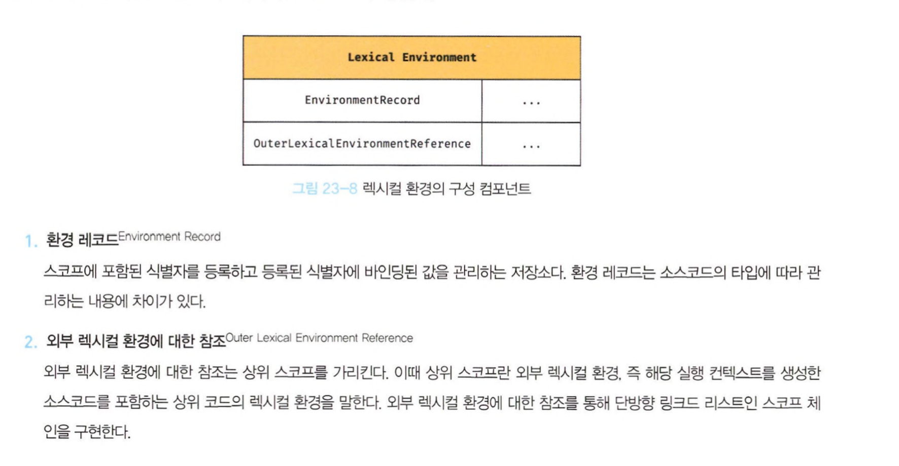
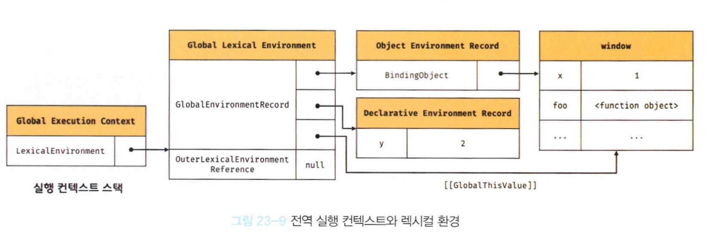
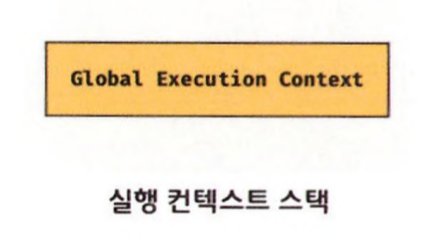
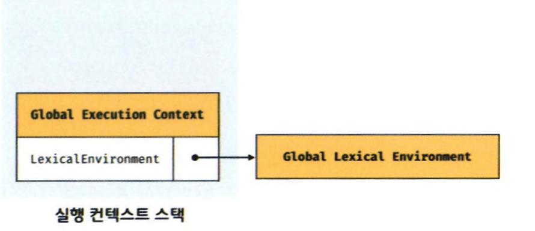

# 실행컨텍스트.

실행 컨텍스트(execute context)는 자바스크립트의 동작 원리를 담고 있는 핵심 개념이다.

## 23.1 소스코드 타입

아래의 4가지 타입의 소스코드는 실행컨텍스트를 생성한다


1. 전역코드

- 전역 코드는 전역 변수를 관리하기 위해 최상위 스코프인 전역 스코프를 생성해야 한다. 그리고 var 키워드
  로 선언된 전역 변수와 함수 선언문으로 정의된 전역 함수를 전역 객체의 프로퍼티와 메서드로 바인딩하고
  참조하기 위해 전역 객체와 연결되어야 한다. 이를 위해 전역 코드가 평가되면 전역 실행 컨텍스트가 생성
  된다.

2. 함수 코드

- 함수 코드는 **지역 스코프**를 생성하고 지역 변수, 매개변수, arguments 객체를 관리해야 한다. 그리고 생성한 지역 스코프를 전역 스코프에서 시작하는 스코프 체인의 일원으로 연결해야 한다. 이를 위해 함수 코드가 평가되면 함수 실행 컨텍스트가 생성된다.

3. eval 코드

   - eval 코드는 strict mode （엄격 모드）에서 자신만의 독자적인 스코프를 생성한다. 이를 위해 eval 코드가 평
     가되면 eval 실행 컨텍스트가 생성된다.

4. 모듈코드

- 모듈 코드는 모듈별로 독립적인 모듈 스코프를 생성한다. 이를 위해 모듈 코드가 평가되면 모듈 실행 컨텍스트가 생성된다

## 23.2 소스코드의 평가와 실행



- 자바스크립트 엔진은 소스코드를 2개의 과정, 즉 “소스코드의 평가”와 “소스코드의 실행” 과정으로 나누어 처리한다.
- 소스코드 평가 과정에서는 실행 컨텍스트를 생성하고 변수, 함수 등의 선언문만 먼저 실행하여 생성된 변수나 함수 식별자를 키로 실행 컨텍스트가 관리하는 스코프（렉시컬 환경의 환경 레코드）에 등록한다. 소스코드 평가 과정이 끝나면 비로소 선언문을 제외한 소스코드가 순차적으로 실행되기 시작한다. 즉, 런타임이 시작된다.

소스코드 평가 과정이 동작하면 변수는 스코프에 등록된후 "undefined" 로 초기화된다
소스코드 실행 과정에서는 변수 할당문 x = 1;만 실행된다. 이때 x변수에 값을 할당하려면 먼저 x 변수가 선언된 변수인지 확인해야 한다.X 변수가 선언된 변수라면 값을 할당하고 할당 결과를 실행 컨텍스트에 등록하여 관리한다

## 23.3 실행컨텍스트의 역할

```js
// 전역 변수 선언 const x = 1;
const y = 2;
// 함수 정의
function foo(a) {
  // 지역 변수 선언
  const x = 10;
  const y = 20;
}
// 머/서드 호출
console.log(a + x + y); // 130
// 함수 호출
foo(100);
// 메서드 호출
console.log(x + y); // 3
```

위와 같은 코드가 있을때 어떻게 평가하고 실행되는지 알아보자

1. 전역코드 평가
   - 전역코드 실행에 앞서 먼저 전역코드의 평가가 이뤄진다.
   - 변수 선언문과 함수 선언문이 먼저 실행되고, 그 결과 생성된 전역 변수와 전역 함수가 실행 컨텍스트가 관리하는 전역 스코프에 등록된다
   - 정의된 전역 함수는 전역 객체의 프로퍼티와 메서드가 된다
2. 전역코드 실행
   - 런타임이 시작되어 전역 코드가 순차적으로 실행되기 시작한다. 이때 전역 변수에 값이 할당되고 함수가 호출된다. 함수가 호출되면 순차적으로 실행되던 전역 코드의 실행을 일시 중단하고 실행 순서를 변경하여 함수 내부로 진입한다
3. 함수코드 평가
   - 함수 호출에 의해 코드 실행 순서가 변경되어 함수 내부로 진입하면 함수 내부의 문들을 실행하기에 앞서 함
     수 코드 평가 과정을 거치며 함수 코드를 실행하기 위한 준비를 한다. 이때 매개변수와 지역 변수 선언문이
     먼저 실행되고, 그 결과 생성된 매개변수와 지역 변수가 실행 컨텍스트가 관리하는 지역 스코프에 등록된다.
     또한 함수 내부에서 시역 변수처럼 사용할 수 있는 arguments 객체가 생성되어 지역 스코프에 등록되고 this 바인딩도 결정된다.
4. 함수코드 실행
   - 런타임이 시작되어 함수 코드가 순차적으로 실행되기 시작한다. 이때 매개변수와 지역 변수에 값이 할당되고 console.log 메서드가 호출된다.

**이처럼 코드가 실행되려면 다음과 같이 스코프. 식별자. 코드 실행 순서 등의관리가 필요하다.**

1. 선언에 의해 생성된 모든 식별자(변수, 함수, 클래스 등)를 스코프를 구분하여 등록하고 상태 변화(식별자에 바인딩된 값의 변화) 를 지속적으로 관리할 수 있어야 한다.
2. 스코프는 중첩 관계에 의해 스코프 체인을 형성해야 한다. 즉, 스크프 체인을 통해 상위 스코프로 이동하며 식별자를 검색할 수 있 어야 한다.
3. 현재 실행 중인 코드의 실행 순서를 변경(예를 들어, 함수 호출에 의한 실행 순서 변경)할 수 있어야 하며 다시 되돌아갈 수도 있 어야 한다.

실행 컨텍스트는 **소스코드를 실행하는 데 필요한 환경을 제공하고 코드의 실행 결과를 실제로 관리하는 영역**이다.
좀 더 구체적으로 말해, 실행 컨텍스트는 식별자(변수, 함수. 클래스 등의 이름)를 등록하고 관리하는 스코프와 코드 실행 순서 관리를 구현한 내부 메커니즘으로, 모든 코드는 실행 컨텍스트를 통해 실행되고 관리된다.

## 23.4 실행컨텍스트 스택

```js
const x = 1;
function foo() {
  const y = 2;
}
function bar() {
  const z = 3;
  console.log(x + y + z);
}
bar();
foo(); // 6
```

위코드는, 전역 코드와 함수 코드로 이루어져 있다. 자바스크립트 엔진은 먼저 전역 코드를 평가하여 전역 실행 컨텍스트를 생성한다. 그리고 함수가 호출되면 함수 코드를 평가하여 함수 실행 컨텍스트를 생성한다.
이때 생성된 실행 컨텍스트는 스택 자료구조로 관리된다 . 이를 실행 컨텍스트 스택이라고 부른다


순서는

1. 전역 코드의 평가와 실행
2. foo 함수 코드의 평가와 실행
3. bar 함수 코드의 평가와 실행
4. foo 함수 코드로 복귀
5. 전역 코드로 복귀

로 진행된다

이처럼 실행 컨텍스트 스택은 **코드의 실행 순서**를 관리한다. 소스코드가 평가되면 실행 컨텍스트가 생성되고
실행 컨텍스트 스택의 최상위에 쌓인다. 실행 컨텍스트 스택의 최상위에 존재하는 실행 컨텍스트는 언제나
현재 실행 중인 코드의 실행 컨텍스트다. 따라서 실행 컨텍스트 스택의 최상위에 존재하는 실행 컨텍스트를 실행 중인 **실행 컨텍스트(running execution context)**라 부른다

## 23.5 렉시컬 환경

렉시컬 환경(lexlcal Environment)은 식별자와 식별자에 바인딩된 값, 그리고 상위 스코프에 대한 참조를 기록하는 자
료구조로 실행 컨텍스트를 구성하는 컴포넌트다. 실행 컨텍스트 스택이 코드의 실행 순서를 관리한다면 렉시컬 환경은 스코프와 식별자를 관리한다.



렉시컬 환경은 키와 값을 갖는 객체 형태의 스코프（전역, 함수, 블록 스코프）를 생성하여 식별자를 키로 등록
하고 식별자에 바인딩된 값을 관리한다. 즉, 렉시컬 환경은 스코프를 구분하여 식별자를 등록하고 관리하는
저장소 역할을 하는 렉시컬 스코프의 실체다

실행 컨텍스트는 LexicalEnvironment 컴포넌트와 VariableEnvironment 컴포넌트로 구성된다.



생성 초기에 LexicalEnvironment 컴포넌트와 VariableEnvironment 컴포넌트는 하나의 동일한 렉시컬 환경을 참조한다다
이후 몇 가지 상황을 만나면 VariableEnvironment 컴포넌트를 위한 새로운 렉시컬 환경을 생성하고, 이때부터 VariableEnvironment 컴포넌트와 LexicalEnvironment 컴포넌트는 내용이 달라지는 경우도 있다.



## 23.6 실행 컨텍스트의 생성과 식별자 검색 과정

```javascript
var x = 1;
const y = 2;

function foo (a) {
    var x = 3;
    const y = 4;
    function bar (b) {
        const z = 5;
        console.loc(a + b x + y + z);
    }
    bar(10)
};
foo(20);
```

위 코드를 예시로 알아보자
일단 제일먼저 전역객체를 생성을 한다. 전역객체는 전역코드가 실행되기 이전에 생성이 된다
전역 객체도 *Object.prototype*을 상속받는다. 즉, 전역 객체도 프로토타입 체인의 일원이다

그 다음 전역 코드 평가가 일어난다.

1. 전역 실행 컨텍스트 생성
2. 전역 렉시컬 환경 생성
   1. 전역 환경 레코드 생성
      1. 객체 환경 레코드 생성
      2. 선언적 환경 레코드 생성
   2. this 바인딩
   3. 외부 렉시컬 환경에 대한 참조 결정

이러한 과정을 거쳐서 평가가 일어난다


사진과함께 자세히 살펴보면

1. 전역 실행 컨텍스트 생성
   - 먼저 비어있는 전역 실행 컨텍스트를 생성하여 실행 컨텍스트 스택에 푸시한다. 이때 전역 실행 컨텍스
     트는 실행 컨텍스트 스택의 최상위 즉 실행 중인 실행 컨텍스트가 된다
     
2. 전역 렉시컬 환경 생성
   - 전역 렉시컬 환경을 생성하고 전역 실행 컨텍스트에 바인딩한다.
   - 았듯이 렉시컬 환경은 2 개의 컴포넌트, 즉 환경 레코드와 외부 렉시컬 환경에 대한 참조 (LexicalEnvironmentReference) 로 구성된다
   - 

2.1 전역환경 레코드 생성
전역 렉시컬 환경을 구성하는 컴포넌트인 전역 환경 레코드는 전역 변수를 관리하는
전역 스코프, 전역 객체의 빌트인 전역 프로퍼티와 빌트인 전역 함수, 표준 빌트인 객체를 제공한다.
기존의 var 키워드로 선언한 전역 변수와 ES6 의 let, const 키워드로 선언한 전역 변수를 구분하여 관리하기 위해 전역 스코프 역할을 하는 전역 환경 레코드는 **객체 환경 레코드**와 **선언적 환경레코드** 로 구성되어 있다

2.1.1. 객체 환경 레코드 생성
전역 환경 레코드를 구성하는 컴포넌트인 객체 환경 레코드는 Bindingobject라고 부르는 객체와 연결된다
