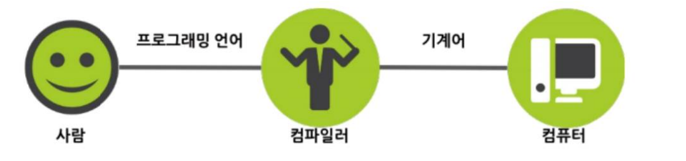
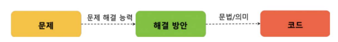
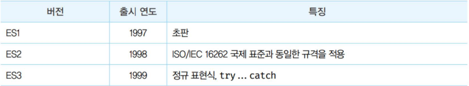
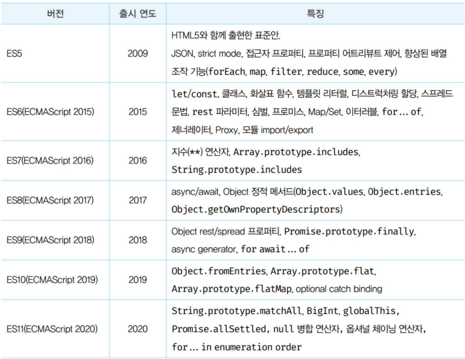
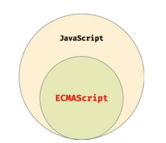
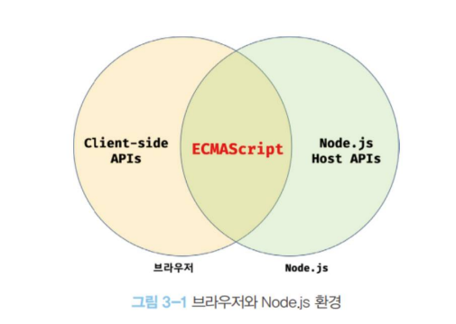

# 프로그래밍

## 1.1 프로그래밍이란?

프로그래밍: 컴퓨터에게 요구하는 커뮤니케이션

문제(요구사항) -> 분해(decomposition) -> 정리 -> 구분(modeling) -> 순서있게 배열;

## 1.2 프로그래밍 언어



기계에게 직접 명령을 전달하는 것은 어렵기 때문에 번역가 역할을 하는 컴파일러 또는 인터프리터가 프로그래밍 언어를 번역해준다.

## 1.3 구문과 의미

언어의 의미는 문맥에 있는 것이지 문법에 있는 것이 아니다!

```js
const number = "hello";
number + number;
```

위와 같은 코드는 문자열 덧셈을 하는 문법에는 맞지만 의미가 없다.



프로 그래밍의 목적은 문제가 해결되어야 의미가 있다.

# 자바스크립트란?

## 2.1 자바스크립트의 탄생

- 1995년
- 넷스케이프 커뮤니케이션즈(Netscape com-munications)에 보조적인 기능을 수행하기 위해 경량 프로그래밍 언어 자바스크립트 탄생
- 1996년
  - 3월: 넷스케이프 내비게이터2(netscape Navigator2) 탑재(브라우저) -> 모카(Mocha)로 명명
  - 9월: 라이브스크립트(LiveScript)로 명칭 변경
  - 12월: 자바스크립트(javaScript)로 최종 명명

## 2.2 자바스크립트의 표준화화

- 1996년
  - 8월: 마이크로 소프트는 JScript를 인터넷 익스플로러 3.0(Internet Explorer 3.0)에 탑재 -> 섞어 쓰던 시기(크로스브라우징 이슈가 발생)
  - 11월: 넷스케이이프에서 표준 기구인 ECMA 인터내셔널에 자바스크립트 표준화를 요청
- 1997년(초판)
  - 7월: ECMA-262라 불리는 표준 자바스크립트 초판 완성 -> ECMAScript로 명명
- 1998년(ES2)
- 1999년(ES3)
  - ECMAScript 3(ES3)이 공개
- 2009년(ES5)
  - ECMAScript 5(ES5) HTML5와 함계 표준으로 출시
    2015년(ES6)
    ECMAScript 6(ECMAScript 2015, ES6) let/const, arrow function, class, module... 도입




# 2.3 자바스크립트 성장 역사

초창기에는 대부분의 로직은 웹서버에서 실행후 브라우저는 서버로 부터 받은 HTML, CSS 단순 렌더

---

**렌더링(rendering)**

- 랜더링이란 HTML, CSS, 자바스크립트로 작성된 문서를 해석해서 브라우저에 전달하는 과정(SSR) 또는 HTML, CSS, 자바스크립트를 로드하고 파싱하는 과정

---

**Ajax(Asynchronous JavaScript and XML) XMLHttpRequest**
서버 <-> 브라우저 비동기 방식으로 데이터 교환

비동기 방식으로 이루어지기 때문에 그전의 고질병인 전체로딩에 의한 화면 깜박임이 사라지고 새로 그려져야 하는 부분요소만 변경하여 부드러운 화면 전환을 가능하게함

2005년의 구글맵스가 대표적

**jQuery**
2006년에 등장한 jQuery의 도움으로 Dom을 더욱 쉽게 제어할 수 있게 되었고 크로스 브라우징 이슈를 어느정도 해결

**V8 자바스크립트 엔진**
2008년도에 등장한 브라우저 엔진 빠른 성능을 가짐 덕분에 프론트엔드 영역이 활성화함

**Node.js**
2009년 라이언 달(Ryan Dahl)이 발표한 Node.js는 V8 엔진의 런타임을 가진다

비동기 I/O(입출력)를 지원 단일 스레드(single thread) 이벤트루프 기반으로 동작하여 빠르고 SPA에 적합

**SPA(Single Page Application) 프레임워크**
브라우저 엔진성능의 증가에 따라 요구사항이 복잡해지게 됨으로써 개발이 어려워짐

이러한 요구에 발맞춰 CBD(Component based development)방법론을 기반으로 하는 SPA가 대중화되며 Angular, React, Vue.js, Svelte 등 프레임워크/라이브러리가 생겨남

# 2.4 자바스크립트와 ECMAScript


평소 부르는 javascript는 WebAPI까지 포함한 경우

# 2.5 자바스크립트의 특징

웹브라우저에서 동작하는 유일한 프로그래밍 언어이다

별도의 컴파일러가 없는 인터프리터 언어이다 현대 자바스크립트 엔진은 인터프리터와 컴파일러를 혼합해서 사용하여 속도가 어느정도 빨라졌다

인터프리터 언어의 특징

- 코드가 실행되는 단계인 런타임에 문 단위로 한 줄씩 중간코드(intermediate code)인 바이트코드로 변환
- 실행파일을 생성하지 않음
- 인터프리트단계와 실행단계가 분리되어 있지 않다
- 한 줄씩 바이트코드로 변환 후 실행
- 속도가 컴파일러에 의한 속도보다 느리다

자바스크립트는 프로토타입 기반의 객체지향 언어이다

# 자바스크립트 개발 환경과 실행방법

# 3.1 자바스크립트 실행환경


