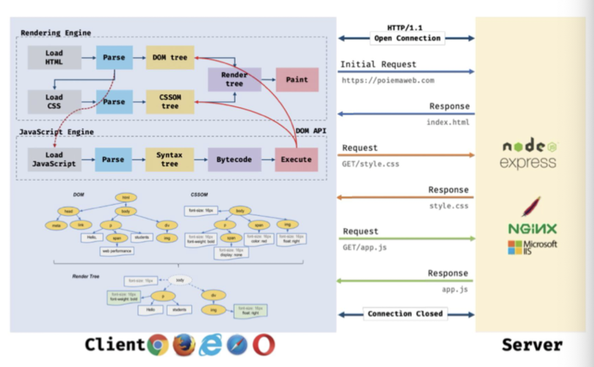
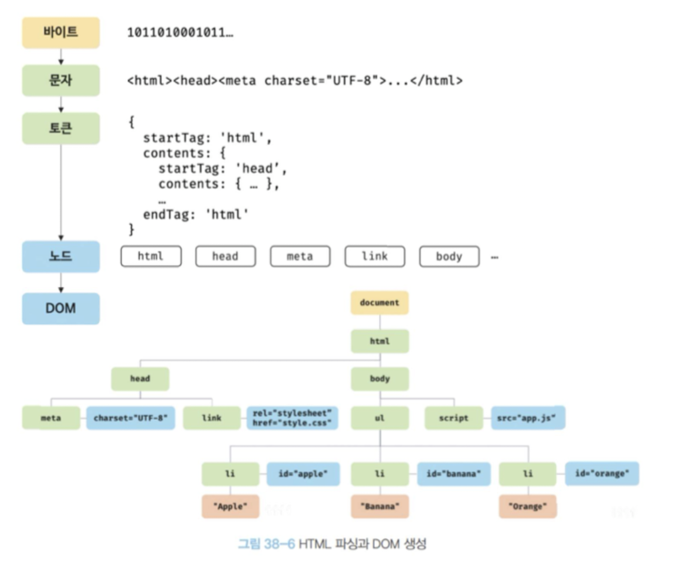
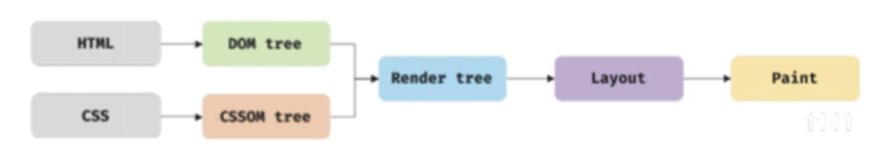
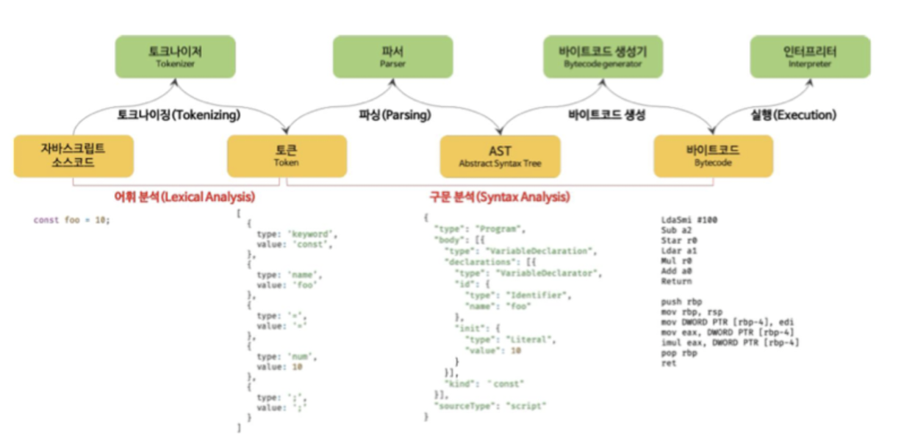

## 브라우저의 렌더링 과정

브라우저가 HTML, CSS, 자바스크립트로 작성된 텍스트 문서를 파싱하여 브라우저에 렌더링 하는 법

- 파싱 parsing:
  파싱은 프로그래밍 언어의 문법에 맞게 작성된 텍스트 문서를 읽어 들여 실행하기 위해 텍스트 문서의 문자열을 토큰으로 분해하고, 토큰에 문법적 의미와 구조를 반영하여 트리 구조의 자료구조인 파스 트리를 생성하는 일련의 과정을 말한다. 일반적으로 파싱이 완료된 이후에는 파스 트리를 기반으로 중간 언어인 바이트코드를 생성하고 실행한다.
- 렌더링 rendering:
  렌더링은 HTML, CSS, 자바스크립트로 작성된 문서를 파싱하여 브라우저에 시각적으로 출력하는 것을 말한다.

1. 브라우저는 HTML, CSS, 자바스크립트, 이미지, 폰트 파일 등 렌더링에 필요한 리소스를 요청하고 서버로부터 응답을 받는다.
2. 브라우저의 렌더링 엔진은 서버로부터 응답된 HTML과 CSS를 파싱하여 DOM과 CSSOM을 생성하고 이들을 결합하여 렌더 트리를 생성한다.
3. 브라우저의 자바스크립트 엔진은 서버로부터 응답된 자바스크립트를 파싱하여 AST를 생성하고 바이트코드로 변환하여 실행한다. 이때 자바스크립트는 DOM API를 통해 DOM이나 CSSOM을 변경할 수 있다. 변경된 DOM과 CSSOM은 다시 렌더 트리로 결합된다.
4. 렌더 트리를 기반으로 HTML 요소의 레이아웃(위치와 크기)을 계산하고 브라우저 화면에 HTML 요소를 페인팅한다.

## 요청과 응답

브라우저의 핵심 기능은 필요한 리소스를 서버에 요청하고 서버로부터 응답받아 브라우저에 시각적으로 렌더링하는 것이다. 서버에 요청을 전송하기 위해 브라우저는 주소창을 제공하며, 브라우저 주소창에 URL을 입력하고 엔터 키를 누르면 URL의 호스트 이름이 DNS를 통해 IP 주소로 변환되고 이 IP 주소를 갖는 서버에게 요청을 전송한다.

## HTTP 1.1과 HTTP 2.0

HTTP는 웹에서 브라우저와 서버가 통신하기 위한 프로토콜(규약)이다.

- HTTP/1.1: 커넥션당 하나의 요청과 응답만 처리하여 리소스의 동시 전송이 불가능하기 때문에 요청 리소스 개수만큼 비례하여 응답 시간도 증가한다.
- HTTP/2.0: 여러 리소스의 동시 전송이 가능하므로 HTTP/1.1에 비해 페이지 로드 속도가 50% 정도 빠르다.

## HTML 파싱과 DOM 생성

**💡DOM(Document Object Model)은 HTML 문서를 파싱한 결과물💡**

브라우저의 렌더링 엔진은 다음 그림과 같은 과정을 통해 응답받은 HTML 문서를 파싱하여 브라우저가 이해할 수 있는 자료구조인 DOM을 생성한다.

1. 서버에 존재하던 HTML 파일이 브라우저 요청에 의해 응답된다. 이때 서버는 브라우저가 요청한 HTML 파일을 읽어 들여 메모리에 저장한 다음 메모리에 저장된 바이트를 인터넷을 경유하여 응답한다.
2. 브라우저는 서버가 응답한 HTML 문서를 바이트 형태로 응답받는다. 그리고 응답된 바이트 형태의 HTML 문서는 meta 태그의 charset 어트리뷰트에 선언된 인코딩 방식은 content-type: text/html; charset=utf-8과 같이 응답헤더에 담겨 응답된다. 브라우저는 이를 확인하고 문자열로 변환한다.
3. 문자열로 변환된 HTML 문서를 읽어 들여 문법적 의미를 갖는 코드의 최소 단위인 토큰들로 분해한다.
4. 각 토큰들을 객체로 변환하여 노드들을 생성한다. 토큰의 내용에 따라 문서 노드, 요소 노드, 어트리뷰트 노드, 텍스트 노드가 생성된다. 노드는 이후 DOM을 구성하는 기본 요소가 된다.
5. HTML 문서는 HTML 요소들의 집합으로 이루어지며 HTML 요소는 중첩 관계를 갖고 부자 관계가 형성된다. 이러한 HTML 요소 간의 부자 관계를 반영하여 모든 노드들을 트리 자료구조로 구성한다. 이 노드들로 구성된 트리 자료구조를 DOM이라 부른다.

## 렌더 트리 생성

레이아웃 계산과 페인팅을 다시 실행하는 리렌더링은 성능에 악영향을 주기 때문에 가급적 리렌더링이 빈번하게 발생하지 않도록 주의할 필요가 있다.

## 자바스크립트 파싱과 실행

자바스크립트 파싱과 실행은 렌더링 엔진이 아닌 자바스크립트 엔진이 처리한다. 자바스크립트 엔진은 자바스크립트 코드를 파싱하여 CPU가 이해할 수 있는 저수준 언어로 변환하고 실행하는 역할을 한다. 렌더링 엔진으로부터 제어권을 넘겨받은 자바스크립트 엔진인 자바스크립트 코드를 파싱하기 시작한다. 렌더링 엔진이 HTML과 CSS를 파싱하여 DOM과 CSSOM을 생성하듯이 자바스크립트 엔진은 자바스크립트를 해석하여 AST(추상적 구문 트리)를 생성하고, AST를 기반으로 인터프리터가 실행할 수 있는 중간 코드인 바이트코드를 생성하여 실행한다.

### 토크나이징

단순한 문자열인 자바스크립트 소스코드를 어휘 분석하여 문법적 의미를 갖는 코드인 최소 단위인 토큰들로 분해한다.

### 파싱

토큰들의 집합을 구문 분석하여 AST를 생성한다. 이는 토큰에 문법적 의미와 구조를 반영한 트리 구조의 자료구조다. AST를 사용하면 트랜스파일러를 구현할 수도 있다.

### 바이트코드 생성과 실행

파싱의 결과물로서 생성된 AST는 인터프리터가 실행할 수 있는 중간 코드인 바이트코드로 변환되고 인터프리터에 의해 실행된다.

## 리플로우와 리페인트

만약 자바스크립트 코드에 DOM이나 CSSOM을 변경하는 DOM API가 사용된 경우 DOM이나 CSSOM이 변경된다. 이때 변경된 DOM과 CSSOM은 다시 렌더 트리로 결합되고 변경된 렌더 트리를 기반으로 레이아웃과 페인트 과정을 거쳐 브라우저의 화면에 다시 렌더링한다. 이를 리플로우, 리페인트라고 한다.

- 리플로우: 레이아웃 계산을 다시 하는 것.
- 리페인트: 재결합된 렌더 트리를 기반으로 다시 페인트를 하는 것

## 자바스크립트 파싱에 의한 HTML 파싱 중단

렌더링 엔진과 자바스크립트 엔진은 병렬적으로 파싱을 실행하지 않고 직렬적으로 파싱을 수행한다. 브라우저는 동기적으로 파싱하고 실행하며 script 태그의 위치는 중요한 의미를 갖는다. script 태그를 body 태그 뒤에 위치하는 것이 좋다.

## script 태그의 async/defer 어트리뷰트

이를 사용하면 HTML 파싱과 외부 자바스크립트 파일의 로드가 비동기적으로 동시에 진행된다.

- async: 자바스크립트의 파싱과 실행은 자바스크립트 파일의 로드가 완료된 직후 진행되며, 이때 HTML 파싱이 중단된다. 순서 보장이 필요한 경우는 지정하면 안된다.

- defer: 자바스크립트의 파싱과 실행은 DOM 생성이 완료된 직후 진행된다.
