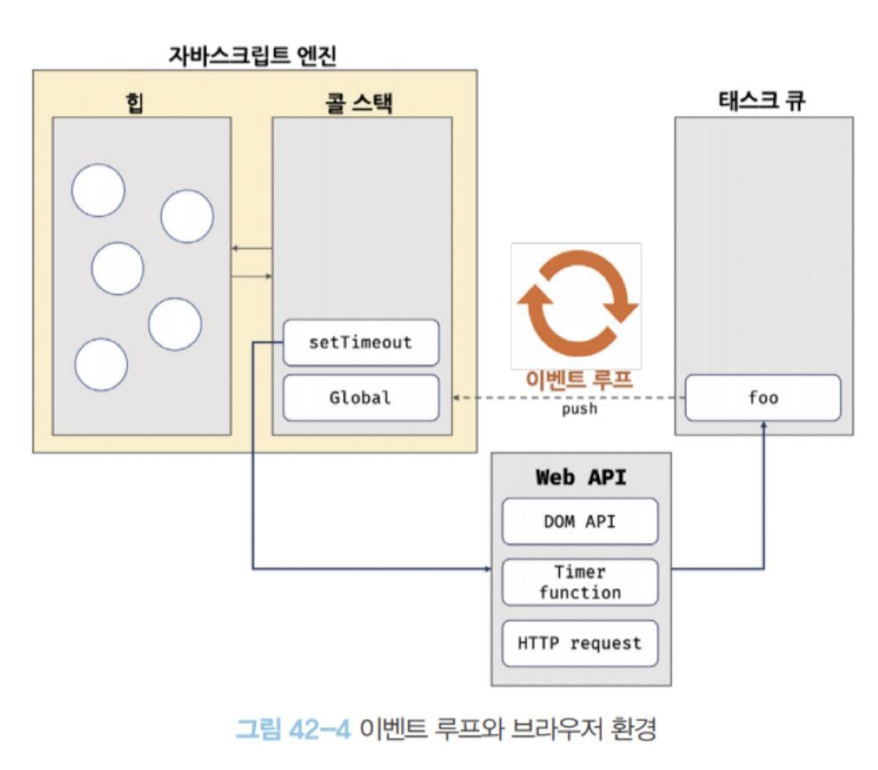

# 비동기 프로그래밍

## 동기 처리와 비동기 처리

- 실행 컨텍스트 스택에 함수 실행 컨텍스트가 푸시되는 것은 바로 함수 실행의 시작을 의미한다.
- 함수의 실행 순서는 실행 컨텍스트 스택으로 관리한다.
- 자바스크립트 엔진은 단 하나의 실행 컨텍스트 스택을 갖는다.

- 동기 처리 방식: 현재 실행 중인 태스크가 종료할 때까지 다음에 실행될 태스크가 대기하는 방식을 동기 처리라고 한다. 태스크를 순서대로 하나씩 처리하므로 실행 순서가 보장된다는 장점이 있지만, 앞선 태스크가 종료할 때까지 이후 태스크들이 블로킹되는 단점이 있다.
- 비동기 처리: 현재 실행 중인 태스크가 종료되지 않은 상태라 해도 다음 태스크를 곧바로 실행하는 방식이다. 비동기 처리 방식은 현재 실행 중인 태스크가 종료되지 않은 상태라 해도 다음 태스크를 곧바로 실행하므로 블로킹이 발생하지 않는다는 장점이 있지만, 태스크의 실행 순서가 보장되지 않는 단점이 있다. 타이머 함수인 setTimeout과 setInterval, HTTP 요청, 이벤트 핸들러는 비동기 처리 방식으로 동작한다.

## 이벤트 루프와 태스크 큐

자바스크립트의 동시성을 지원하는 것이 바로 이벤트 루프다.

자바스크립트 엔진은 크게 2개의 영역을 구분할 수 있다.

- 콜 스택: 소스코드 평가 과정에서 생성된 실행 컨텍스트가 추가되고 제거되는 스택 자료구조인 실행 컨텍스트 스택이 콜 스택이다.
- 힙: 객체가 저장되는 메모리 공간이며, 콜 스택의 요소인 실행 컨텍스트는 힙에 저장된 객체를 참조한다.

비동기 처리에서 소스코드의 평가와 실행을 제외한 모든 처리는 자바스크립트 엔진을 구동하는 환경인 브라우저 또는 Node.js가 담당한다. 이를 위해 브라우저 환경은 태스크 큐와 이벤트 루프를 제공한다.

- 태스트 큐: 비동기 함수의 콜백 함수 또는 이벤트 핸들러가 일시적으로 보관되는 영역
- 이벤트 루프: 콜 스택에 현재 실행 중인 실행 컨텍스트가 있는지, 그리고 태스크 큐에 대기중인 함수가 있는지 반복해서 확인한다. 만약 콜스택이 비어 있고 태스크 큐에 대기 중인 함수가 있다면 이벤트 루프는 순차적으로 태스크 큐에 대기 중인 함수를 콜 스택으로 이동시킨다.

자바스크립트 엔진은 싱글 스레드로 동작하지만 브라우저는 멀티 스레드로 동작한다. 브라우저와 자바스크립트 엔진이 협력하여 비동기 함수를 실행하게 된다.
